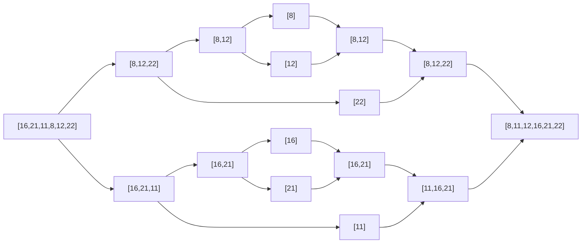

# Merge Sort Projesi

## Aşamalar diagramla gösterilmiştir.

```mermaid
graph LR
A["[16,21,11,8,12,22]"] --> B["[8,12,22]"]
A --> C["[16,21,11]"]
C --> E["[11]"]
C --> D["[16,21]"]
D --> F["[21]"]
D --> G["[16]"]
B --> I["[22]"]
B --> H["[8,12]"]
H --> J["[12]"]
H --> K["[8]"]
G --> L["[16,21]"]
F --> L
L --> M["[11,16,21]"]
E --> M
K --> N["[8,12]"]
J --> N
N --> O["[8,12,22]"]
I --> O
O --> P["[8,11,12,16,21,22]"]
M --> P
```

## Big-O

Avarage,Best and Worst Case's = O(n * logn)
